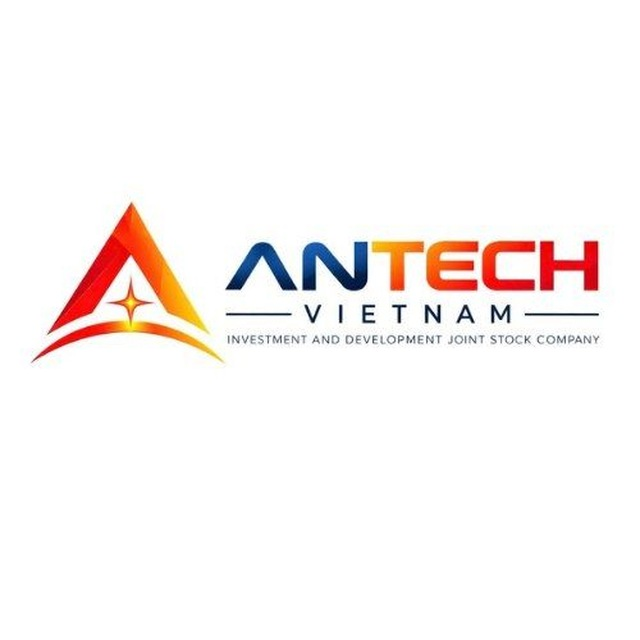

<!-- Replace with your actual logo -->

# AntechVietnam

**B2B Technology Partner — ERP & Enterprise Solutions for Vietnam and Beyond**

---

## 👋 About Us

**AntechVietnam** partners with businesses to design, build, and maintain enterprise-grade technical solutions. We specialize in **ERP systems** and custom B2B software that help companies across industries — in Vietnam and internationally — digitize operations, connect systems, and scale reliably.

We work as an extension of our clients' engineering teams: from initial architecture to long-term production support.

---

## 🚀 What We Do

- **ERP Development** — custom ERP modules and full-scale implementations tailored to specific industry workflows
- **B2B Software Solutions** — internal tools, integration platforms, and business-critical applications
- **System Integration** — connecting ERPs, CRMs, e-commerce, and third-party services into one cohesive stack
- **DevOps & Infrastructure** — CI/CD pipelines, cloud infrastructure, monitoring, and reliability engineering
- **Long-term Technical Support** — maintenance, scaling, and continuous improvement for production systems

---

## 🏭 Industries We Serve

Manufacturing • Retail & Distribution • Logistics • Finance • Healthcare • and other industry sectors across Vietnam and international markets.

---

## 🛠️ Tech Stack

*(Update this list to match your actual stack)*

---

## 💡 Why Partner With Us

- **Industry-tailored ERP** — not off-the-shelf, built around how your business actually operates
- **End-to-end ownership** — from architecture to deployment to ongoing support
- **Local expertise, global standards** — built for the Vietnamese market with practices that scale internationally
- **Long-term partnership model** — we stay involved after launch, not just for the initial build

---

## 📂 Featured Projects

<!-- List public/showcase repos here, or link to case studies -->
- [Project Name](https://github.com/antechvietnam/project-repo) — short one-line description
- [Project Name](https://github.com/antechvietnam/project-repo) — short one-line description

---

## 📬 Get in Touch

Looking for a technical partner to build or scale your ERP / business systems?

- 🌐 Website: [antechvietnam.com](https://antechvietnam.com)
- ✉️ Email: [contact@antechvietnam.com](mailto:contact@antechvietnam.com)
- 💼 LinkedIn: [AntechVietnam](https://linkedin.com/company/antechvietnam)
- 📍 Based in Vietnam, working with clients worldwide

*Building reliable technical foundations for growing businesses.*

